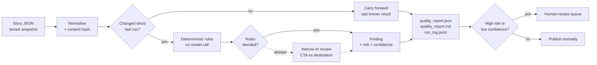

# Story QA Gate

[](https://github.com/WiseFlow-dev/story-qa-gate/actions/workflows/verify.yml)

A small automatic quality gate for Story content. It reads a Story snapshot, decides what it can prove with cheap rules, asks a model only about the bit the rules cannot settle, and sends a human only what is actually uncertain or risky.

*Mohamad Ismail. Built and tested in roughly 80 to 90 minutes with AI assistance. The prompts I used are in the appendix at the bottom.*



Solid arrows never call a model. The one dashed path is the only place AI is used.

---

## Proof it runs automatically

Two runs over the same input. The second does no work, but still reports everything:

```
$ python qa_gate.py sample_stories.json --out output
tenant_antarctic_league_001 | 2 stories, 4 pages | 0 fail, 1 warning | 1 needs review
delta: 2 new, 0 changed, 0 unchanged, 0 carried forward

$ python qa_gate.py sample_stories.json --out output
tenant_antarctic_league_001 | 2 stories, 4 pages | 0 fail, 1 warning | 1 needs review
delta: 0 new, 0 changed, 2 unchanged, 2 carried forward
```

Clone it and run those two commands and you will see exactly this. I did not commit `state.json`, so your first run is genuinely cold. The report in `output/` is from a cold run, so it reproduces.

Every run appends a line to `run_log.jsonl`, giving me an audit trail of each execution. `.github/workflows/verify.yml` runs the tests plus a cold pass and a warm pass on every push, daily, and on demand, and asserts the delta each time.

**At 5,000 Stories and 10,000 pages** (`scripts/generate_synthetic_data.py`, roughly 5% seeded defects):

| Cold run | |
|---|---|
| Throughput | ~2,100 stories/sec |
| Peak traced memory | 10.1 MB |
| Findings | 70 failures, 249 warnings |
| **Distinct pages sent to a human** | **178, which is 1.8% of pages** |
| Recommendations needing no review | 141 |

A warm run over the same input does no evaluation work and reports the identical picture from state.

1.8% is the whole point. A person looks at under two pages in a hundred instead of all of them, and the 141 low-risk items they are *not* shown are still reported for the publisher to just fix.

Throughput is from one laptop run and will move around. Treat the shape as the claim, not the exact number.

---

## The real problem

At high volume nobody can look at everything, so mistakes reach readers. The mistakes that matter are boring ones. A CTA that promises one thing and links somewhere else. A draft title that shipped. A link pointing at the wrong domain. The same asset quietly reused in two Stories.

The obvious move is to send every Story to a model and ask if it looks good. I did not do that. It costs too much at volume, it gives you a different answer on a rerun, a publisher cannot act on the output, and you cannot write a test for it.

## The product decision

**Rules first. The model only where rules give up. Humans only for risk.**

1. Rules settle anything provable from structure. Free, explainable, same answer every time.
2. If a CTA and its destination path both classify confidently into *different* known intents, that is a mismatch by rule. No model needed.
3. If either side cannot be classified, the rules **abstain** instead of guessing. Only that subset goes to the model.
4. The model returns strict JSON with a decision and a confidence. It never blocks publishing on its own.
5. Every finding carries a `risk`. A wrong outbound link is user-visible and reputational, so it is high. A metadata problem is not. High risk or low confidence goes to a human.

Step 3 is the one that matters. "I could not classify this CTA" is counted as a **coverage metric**, never raised as a finding. Reporting your own uncertainty as if it were a defect is how a review queue fills up with things nobody can action.

### Where this comes from

I did not invent this shape for the task. I use it in production in a personal finance app I built, where an automatic categorisation pass decides what it is confident about, sends the rest to review, and reuses confirmed decisions later. A wrong automatic decision there costs someone real money. That is where the habit of making rules abstain instead of guess comes from.

## What v1 does

- 13 rule checks across structure, editorial quality, and CTA/destination consistency, plus one finding type only the model can raise (`semantic_review_uncertain`)
- Tenant policy as config (`tenant_policy.json`): allowed hosts, intent vocabulary, generic CTA list, placeholder markers
- Stateful reruns keyed by content hash, so an unchanged Story is never checked twice
- One narrow AI review over the abstained subset, from a committed cache of real model responses
- JSON report for machines, Markdown for humans, append-only run log
- 30 tests, and CI that asserts the rerun behaviour instead of just checking the code imports

## What v1 does not do, on purpose

- **No live link checking.** Link reachability is not checked in v1. Calling something broken without actually requesting it would be inventing a result, and doing it safely needs SSRF controls, DNS pinning protection, redirect handling and rate limits. That is a service, not a function.
- **No blocking.** v1 warns. I am not holding back someone's publishing on the word of a checker nobody has measured yet.
- **No visual analysis** of the image or video itself.
- **No learning loop.** The feedback design is in `DESIGN.md`, but nothing here retrains or changes itself.
- **No dashboard, database, or auth.**

## How to run it

```
python qa_gate.py sample_stories.json --out output
python -m unittest discover -s tests
```

No dependencies. Standard library, Python 3.9+.

## Example result

`sample_stories.json` is the payload from the brief. The gate flags one page:

```
- story_123 / page_2  cta_destination_mismatch
  - WARNING: CTA 'Buy tickets' appears inconsistent with destination path '/highlights'.
  - Risk: high | Confidence: medium | Source: rule
```

Full output in [`output/quality_report.md`](output/quality_report.md) and [`output/quality_report.json`](output/quality_report.json).

## Assumptions I made

- `action` is optional. A page with no CTA is not a defect.
- If an action exists, both the CTA and the destination should be there.
- HTTPS is required in v1.
- I only judge asset type when the URL has a recognisable extension. A signed or extensionless CDN URL proves nothing.
- `tenant_policy.json` is example config for the fictional tenant in the brief. It is not any real customer's policy.
- Host matching is **exact hostname equality**. `endswith("example.com")` would also accept `evil-example.com` and `example.com.attacker.net`. Doing registrable-domain matching properly needs a maintained Public Suffix List, which is future work, so every allowed subdomain is listed explicitly.

## One honest limitation

The cross-Story checks, currently duplicate asset reuse, are **batch-scoped**. They only see one snapshot. Real Stories arrive as a stream, so in production these need a rolling per-tenant window. That is the first thing I would want engineering help with, along with tenant policy management and an async link-health worker.

## How feedback makes the product better

v1 does not learn by itself. But it is ready to use human feedback in a controlled way.

When someone reviews a finding, I would save their decision, why it was flagged, the tenant, and the rule or prompt version behind it. Over time, that shows me which checks are useful and which ones are creating noise.

I could then test a better rule or prompt on past reviewed examples before using it live. Nothing changes automatically: a person reviews any improvement first. That is how repeated cases stop wasting human time, while new or risky cases still go to review.

## AI use

The model does exactly one job: decide whether a CTA matches its destination, and only on pages where the rules abstained *and* nothing high risk was already found there. If a rule already flagged the page, a human is looking at it anyway, so a model call would buy nothing.

It gets the CTA text and the destination path. Nothing else. Story title and categories are deliberately not sent yet: they would widen the data leaving the tenant boundary, and I have not shown they improve the decision.

It returns strict JSON:

```json
{ "decision": "match | mismatch | uncertain", "confidence": "low | medium | high", "reason": "..." }
```

`ai_semantic_cache.json` holds **real model responses**. I recorded them so this repo, its tests and its report all reproduce offline with no API key and no network. Each entry stores the model, prompt version, policy version, timestamp and `execution_mode`. A live reviewer implements the same `review()` signature and writes back into the same cache.

The cache key includes `tenant_id` and `policy_version` on purpose. A cache keyed only on `(cta, path)` would apply one tenant's decision under another tenant's policy, which is a cross-tenant leak.

**See it working:** [`output/ai_example/quality_report.md`](output/ai_example/quality_report.md) runs the gate over the ambiguous fixture. One case is settled by rule with no model call. Four cases the rules gave up on go to the model, which flags two and stays quiet on the two that genuinely match. The `Source:` line on each finding tells you which one decided it.

See [`DESIGN.md`](DESIGN.md) for the human review loop, the feedback design, and the multi-tenant safeguards.

---

## Appendix: prompts used

**Semantic review prompt** (`semantic_review_v1`, the only prompt in the running system):

```
You are reviewing whether a call-to-action button matches the page it links to.

CTA text: {cta}
Destination path: {url_path}

Decide whether a reader tapping this CTA would land on what they were promised.

Return ONLY strict JSON, no prose:
{"decision": "match" | "mismatch" | "uncertain",
 "confidence": "low" | "medium" | "high",
 "reason": "<one short sentence>"}

Rules:
- Answer "uncertain" when the path is opaque (an ID, a hash, a slug with no
  readable intent). Do not guess.
- Answer "mismatch" only when a reader would clearly land somewhere other than
  what the CTA offered.
- Never invent information about the destination that is not in the inputs.
```

**Test data prompt**, used to produce the fixture set:

```
Generate Story JSON fixtures matching this schema for a fictional sports tenant.
Produce four files: one entirely clean, one with structural defects (missing ids,
non-https, type/extension conflict, incomplete action, embedded credentials in a
URL), one with ambiguous CTA/destination pairs where keyword rules cannot decide,
and one with editorial defects (draft placeholder title, generic CTA, lookalike
destination host, an asset reused across two Stories). Keep every value fictional.
```
